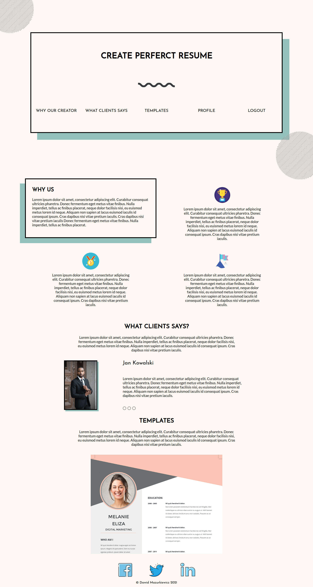
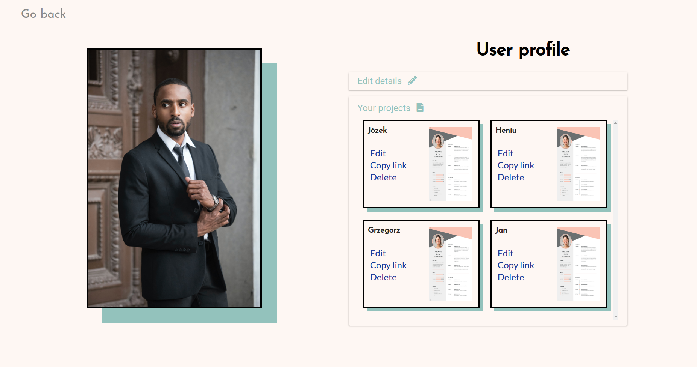
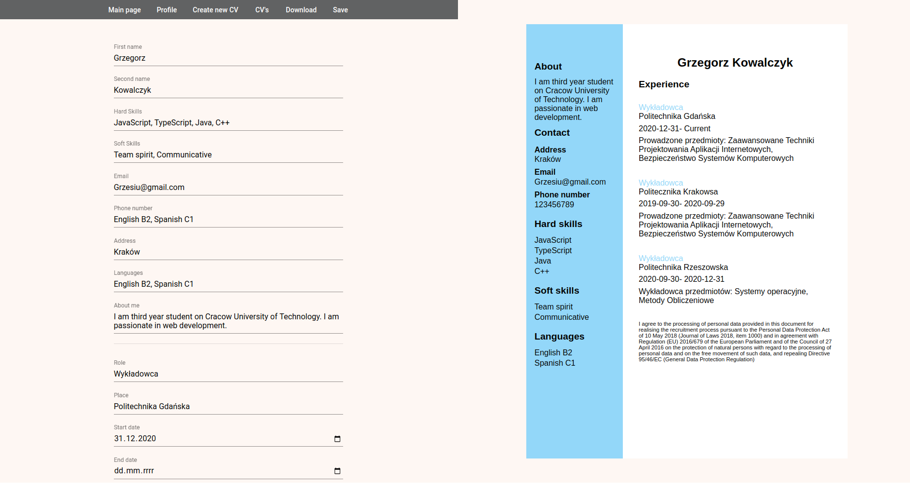

# CV-builder
The project involves the creation of a CV builder. The user will be able to choose one of several templates and complete the data through a form that will dynamically update the CV view. The data can be saved permanently in the user's profile and then load it into the form in just one click.

## Table of contents
* [Technologies](#technologies)
* [Setup](#setup)
* [Site](#site)

## Technologies
* HTML 5
* CSS 3 (SCSS)
* JavaScript ECS6
* TypeScript
* Angular
* Node.js (Express.js)

## Setup
Run server
```
$ cd Backend
$ npm start
```

Run frontend
```
$ cd CV-creator
$ npm start
```

## Site
Main page
<p align="center">
  
</p>

Profile
<p align="center">
  
</p>

Creator
<p align="center">
  
</p>
